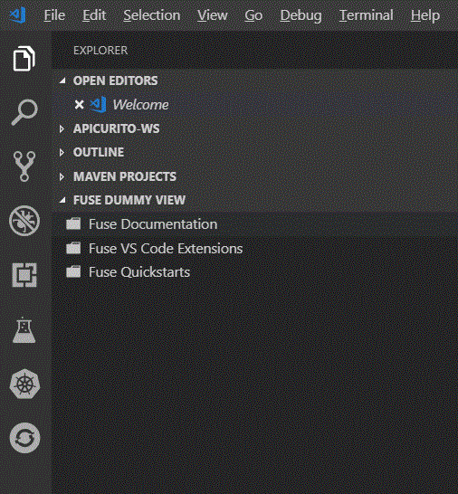
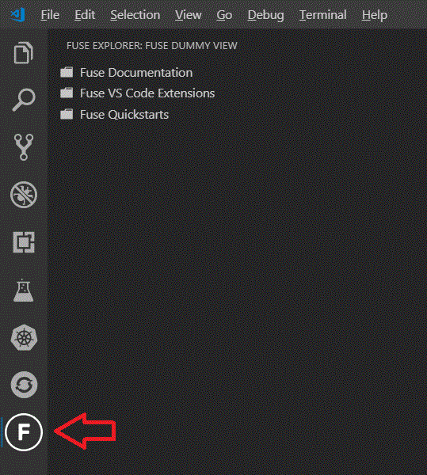

# vscode-fuse

Work in progress investigation into use of a Fuse specific "view" in VS Code.

## Current status

* Created simple "Fuse Dummy View" that provides three nodes in a view in the VS Code Side Bar.
* Created simple "Fuse Explorer" with F inside circle icon in the Activity Bar that contains the Fuse Dummy View.

Note: No parent/child relationship exists in these items at present, but we could certainly add that.

## Next steps

* Link the Fuse Documentation node to [Red Hat Fuse - Docs and APIs](https://developers.redhat.com/products/fuse/docs-and-apis/) - using a WebView to show the documentation inside VS Code.
* Link the Fuse VS Code Extensions node to [Extension Pack for Apache Camel](https://marketplace.visualstudio.com/items?itemName=camel-tooling.apache-camel-extension-pack) - provide an action to possibly install this and/or test to see if it's already installed and update the label accordingly?
* Remove/hide the Fuse Quickstarts node for now? Don't want to step on the [Project Initializer by Red Hat extension](https://marketplace.visualstudio.com/items?itemName=redhat.project-initializer) since we are working to improve that for use with Fuse/Camel examples

## Current screen shots

### Dummy View included in main Side Bar

### Dummy View in Activity Bar

## Resources

* Tree View example from Microsoft - relies on unreleased APIs at present [Code here](https://github.com/Microsoft/vscode-extension-samples/tree/master/tree-view-sample/src)
* Possible example that relies on an older model [References view](https://github.com/Microsoft/vscode-references-view/blob/master/src/provider.ts)
* Great article walks through using the tree model [here](https://medium.com/@sanaajani/creating-your-first-vs-code-extension-8dbdef2d6ad9)

## Icon

* F inside a circle icon [link](https://www.flaticon.com/free-icon/f-inside-a-circle_12605#term=letter%20f&page=1&position=6)
