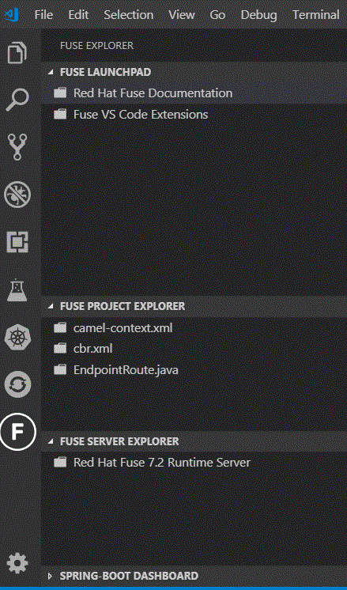
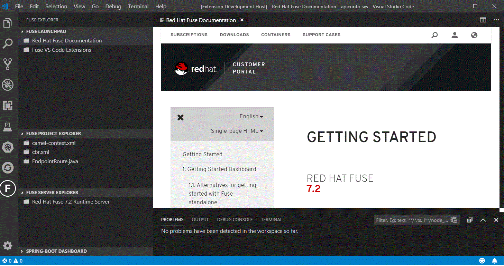
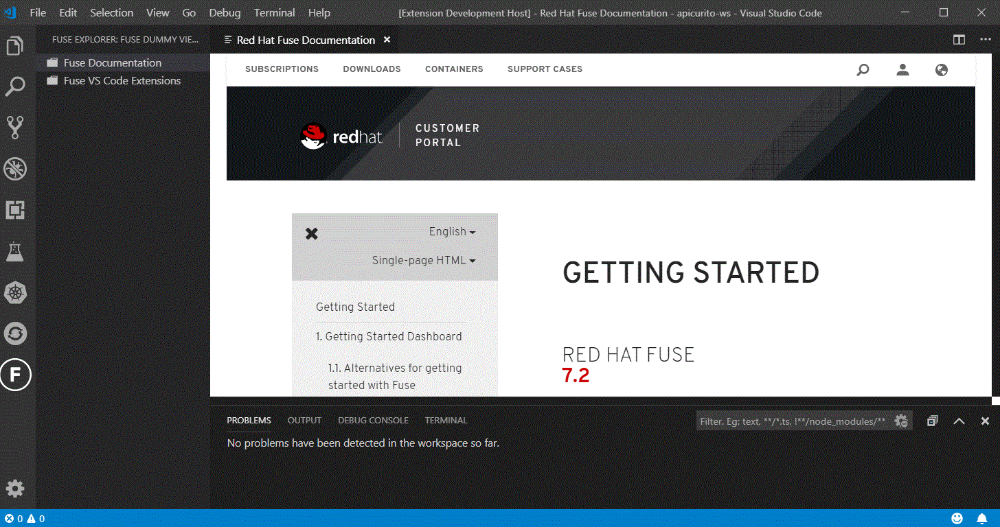
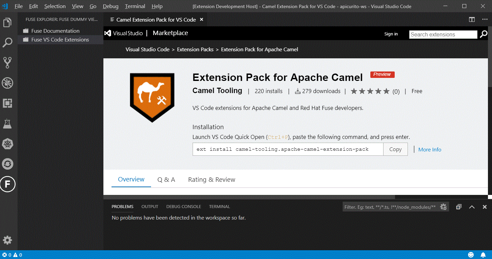

# vscode-fuse

Work in progress investigation into use of a Fuse specific "view" in VS Code.

## Current status

* Created simple "Fuse Dummy View" that provides three nodes in a view in the VS Code Side Bar.
* Created simple "Fuse Explorer" with F inside circle icon in the Activity Bar that contains the Fuse Dummy View.
* Set up the Fuse Documentation node to show a web view of the [Red Hat Fuse Getting Started Guide for Fuse 7.2](https://access.redhat.com/documentation/en-us/red_hat_fuse/7.2/html-single/getting_started/index)
* Set up the FuseVS Code Extensions node to show a web view of the [Extension Pack for Apache Camel page in the VS Code Marketplace](https://marketplace.visualstudio.com/items?itemName=camel-tooling.apache-camel-extension-pack)
* Hid the Fuse Quickstarts node for now
* Created a fuller "dashboard" concept containing a project view, a server view, and the spring-boot view.

Note: No parent/child relationship exists in these items at present, but we could certainly add that.

### Fuse Dashboard Notes

Some of these options are available in our Classic Eclipse tooling and might be helpful in the context of a VS Code workbench. Possible activities useful to a user in a Fuse Dashboard in VS Code might include...

#### Fuse Launchpad

* Provide links to Fuse docs
* Possibly provide links to other useful Fuse/Camel VS Code Extensions?
* Possibly provide some sort of quickstart explorer that could be used to quickly clone projects from github to give users a starting point?

#### Fuse Project Explorer

* Show outline of any Fuse/Camel configurations discovered in the project (spring, blueprint, java)
* Enable one click open of any Fuse/Camel configuration
* Enable exploration and management (add/remove) dependencies - possibly validation of dependencies to see if any are used/not used

#### Fuse Server Explorer (needed?)

* Show list of configured Fuse standalone servers
* Enable deployment of Fuse Project to configured server
* Enable start/stop
* Enable way to show server console

#### Spring Boot Explorer

* Show list of configured Spring Boot servers. Potentially reuse Spring Boot Dashboard view from https://marketplace.visualstudio.com/items?itemName=vscjava.vscode-spring-boot-dashboard

## Next steps

* What do we want the Fuse “icon” to be? We really don’t have one at this time (unlike the OpenShift project, etc.).
* What else do we want to include in this collection? OpenShift Application Explorer from the OpenShift Activity? 
* Servers view in flight? - [VS Code Adapters](https://github.com/redhat-developer/vscode-adapters)
* Possible - Provide an action to possibly install the Camel Extension Pack and/or test to see if it's already installed and update the label accordingly?
* Question - What can we do with Fuse Quickstarts? Don't want to step on the [Project Initializer by Red Hat extension](https://marketplace.visualstudio.com/items?itemName=redhat.project-initializer) since we are working to improve that for use with Fuse/Camel examples

Note: Would be nice if we could embed views from other activities in our activity, reusing content. I asked this question https://stackoverflow.com/questions/55716615/created-my-own-viewscontainer-can-i-include-views-from-other-viewscontainers and the answer is "not yet". Opened new issue now for VS Code upstream https://github.com/Microsoft/vscode/issues/72453 - also contributed additional comments/questions to that issue.

## Current screen shots

### Fuller Fuse Dashboard idea with Docs page open

### Dummy View with Docs page open

### Dummy View with Extensions page open

### Dummy View in Activity Bar

### Dummy View included in main Side Bar

## Resources

* Tree View example from Microsoft - relies on unreleased APIs at present [Code here](https://github.com/Microsoft/vscode-extension-samples/tree/master/tree-view-sample/src)
* Possible example that relies on an older model [References view](https://github.com/Microsoft/vscode-references-view/blob/master/src/provider.ts)
* Great article walks through using the tree model [here](https://medium.com/@sanaajani/creating-your-first-vs-code-extension-8dbdef2d6ad9)

## Icon

* F inside a circle icon [link](https://www.flaticon.com/free-icon/f-inside-a-circle_12605#term=letter%20f&page=1&position=6)
